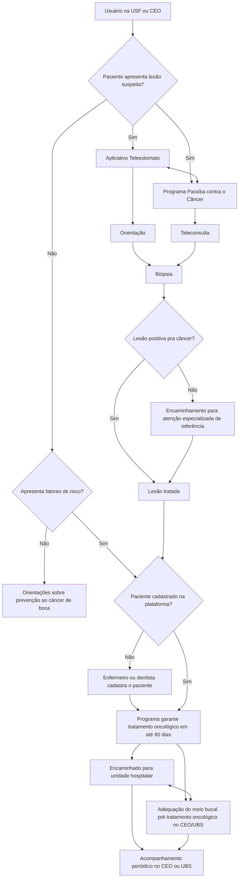
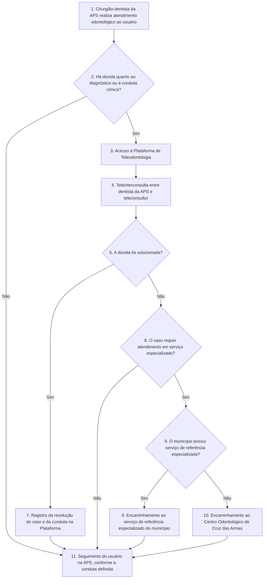

# Fluxogramas

Transcrição do conteúdo dos dois fluxogramas enviados (imagens 1 e 2).

---

## Fluxograma 1 — Paraíba contra o Câncer

### Etapas do fluxo

1. **Usuário na USF ou CEO**
2. **Paciente apresenta lesão suspeita?**
   - **Sim** →
     - **Aplicativo Teleestomato** ↔ **Programa Paraíba contra o Câncer** (comunicação nos dois sentidos entre as duas frentes)
       - Aplicativo Teleestomato → **Orientação**
       - Programa Paraíba contra o Câncer → **Teleconsulta**
     - Orientação e Teleconsulta convergem para → **Biópsia**
       - **Lesão positiva pra câncer?**
         - **Não** → **Encaminhamento para a atenção especializada de referência para tratamento da lesão**
         - **Sim** → **Lesão tratada**
       - Encaminhamento para atenção especializada também desemboca em **Lesão tratada**
       - Lesão tratada → segue para a checagem de cadastro na plataforma (ver abaixo)
   - **Não** → **Apresenta fatores de risco?**
     - **Não** → **Orientações sobre prevenção ao câncer de boca**
     - **Sim** → segue para a checagem de cadastro na plataforma (ver abaixo)

3. **O paciente está cadastrado na plataforma Paraíba contra o Câncer?** *(ponto para onde convergem "Lesão tratada" e "Apresenta fatores de risco? → Sim")*
   - **Não** → **Enfermeiro ou dentista cadastra o paciente na plataforma** → **Programa garante tratamento oncológico em até 60 dias**
   - **Sim** → **Programa garante tratamento oncológico em até 60 dias**
     - → **Paciente é encaminhado para unidade hospitalar** ↔ **Adequação do meio bucal pré tratamento oncológico no CEO ou UBS** (fluxo nos dois sentidos)
     - Ambos → **Acompanhamento periódico no CEO ou UBS**

> ⚠️ Observação: as linhas de conexão do lado direito do fluxograma original são bastante sinuosas (contornam a página). A leitura acima é a melhor interpretação da lógica do fluxo; vale conferir contra a imagem original se precisão milimétrica for necessária.

### Diagrama (Mermaid)

---

## Fluxograma 2 — Fluxo de Teleodontologia (Atenção Primária à Saúde)

### Etapas do fluxo

1. **Cirurgião-dentista da Atenção Primária à Saúde (APS)** realiza atendimento odontológico ao usuário.
2. **Há dúvida quanto ao diagnóstico ou à conduta clínica?**
   - **Não** → vai direto para a etapa 11
   - **Sim** → etapa 3
3. **Acesso à Plataforma de Teleodontologia.**
4. **Realização de teleinterconsulta** entre o cirurgião-dentista da APS e o teleconsultor, para discussão do caso clínico e definição da conduta.
5. **A dúvida foi solucionada?**
   - **Sim** → etapa 7
   - **Não** → etapa 8
6. *(não há etapa 6 numerada no fluxograma original)*
7. **Registro da resolução do caso e da conduta adotada** na Plataforma de Teleodontologia → segue para a etapa 11.
8. **O caso requer atendimento em serviço especializado?**
   - **Não** → vai direto para a etapa 11
   - **Sim** → etapa 9
9. **O município possui serviço de referência especializada para este caso?**
   - **Sim** → **(9)** Encaminhamento do usuário ao serviço de referência especializado do município → etapa 11
   - **Não** → **(10)** Encaminhamento do usuário ao Centro Odontológico de Cruz das Armas → etapa 11
11. **Seguimento do usuário na Atenção Primária à Saúde (APS)**, conforme a conduta definida na teleinterconsulta.

### Diagrama (Mermaid)

