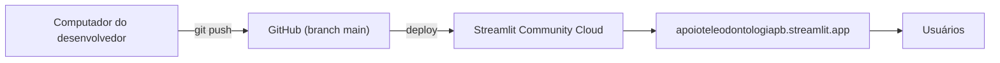
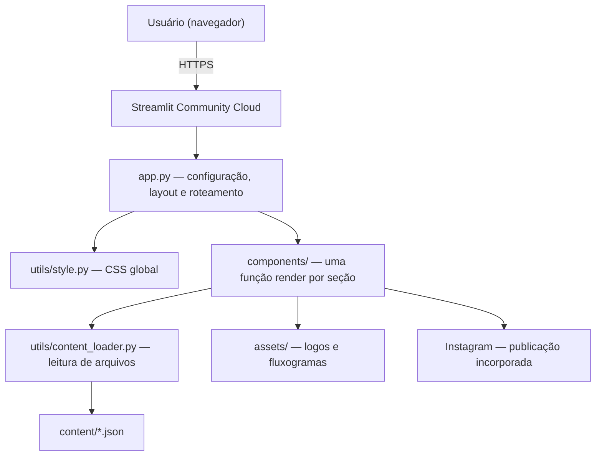
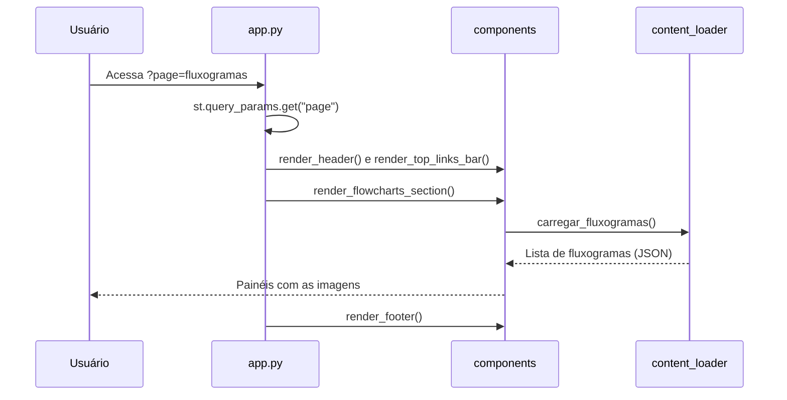
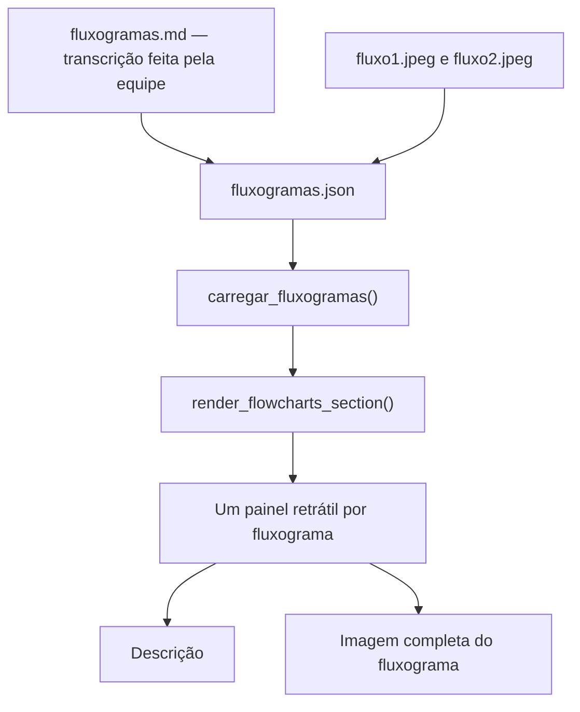
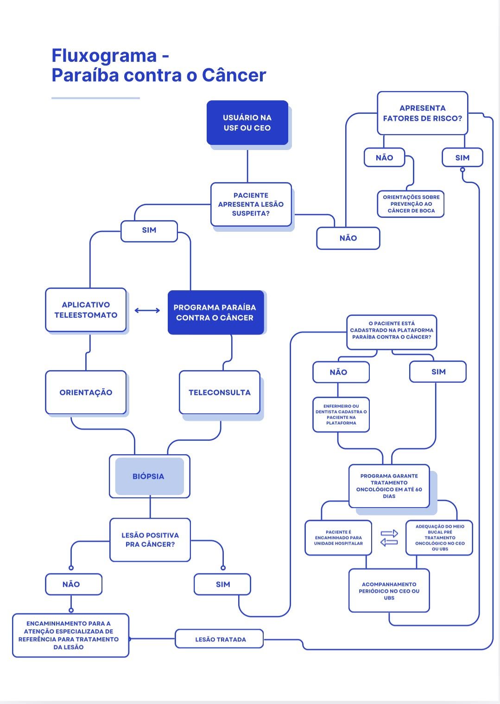
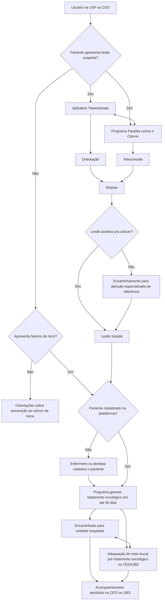
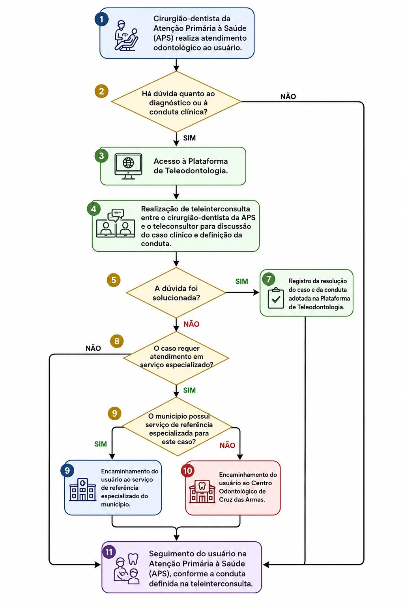
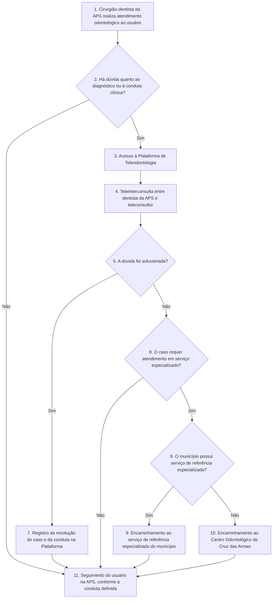
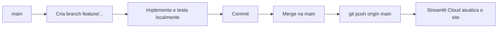

# Repositório de Apoio à Teleodontologia e Telessaúde no Estado da Paraíba

## Apresentação Técnica

PET-Saúde Informação e Saúde Digital no SUS – Paraíba (GT03 / GT04)
SES-PB · UFPB · PET Saúde Digital

- **Site público:** https://apoioteleodontologiapb.streamlit.app/
- **Código-fonte:** https://github.com/lucasmarinhoba/repositorio_teleodontologia_telessaude_pb

---

## Roteiro

1. O problema e a proposta
2. Tecnologias: o que são e por que foram escolhidas
3. Requisitos funcionais e não funcionais (com situação atual)
4. Arquitetura do sistema
5. Estrutura do código
6. Como cada fase foi implementada (incluindo os fluxogramas clínicos publicados)
7. Versionamento e publicação
8. Problemas técnicos enfrentados e soluções

---

## 1. O problema e a proposta

**Problema:** as informações sobre teleodontologia e telessaúde na Paraíba estão espalhadas entre instituições, projetos e páginas diferentes.

**Proposta:** um portal público que funcione como **ponto de entrada único**, organizando a informação e levando o usuário aos serviços oficiais.

> O portal **não substitui** os sistemas oficiais. Ele é um repositório de apoio que organiza a informação e direciona o usuário.

Diretrizes do documento de requisitos:

- público, gratuito e acessível pela Internet (sem `localhost`)
- feito em Python
- sem banco de dados na primeira versão
- preparado para crescer no futuro (busca, chatbot)

---

## 2. Tecnologias utilizadas

| Camada | Tecnologia | Função no projeto |
|---|---|---|
| Linguagem | **Python** | Todo o código da aplicação |
| Framework web | **Streamlit** | Transforma o código Python em páginas web |
| Estilo | **HTML + CSS** | Layout e identidade visual personalizados |
| Conteúdo | **JSON + Markdown** | Links e fluxogramas guardados como arquivos |
| Imagens | **PNG / JPEG** | Logotipos e fluxogramas |
| Versionamento | **Git** | Histórico de alterações do código |
| Repositório | **GitHub** | Armazenamento remoto do código |
| Hospedagem | **Streamlit Community Cloud** | Publica o site com URL pública |
| Banco de dados | **Nenhum** | Não é necessário nesta versão |

---

## 2.1 O que é Python?

**Python** é uma linguagem de programação de alto nível, gratuita e de código aberto, conhecida pela sintaxe simples e legível.

**Por que foi escolhida:**

- **Requisito do projeto (RNF03):** o documento de requisitos define Python como linguagem principal.
- **Curva de aprendizado baixa:** facilita a manutenção por estudantes e profissionais de saúde que não são programadores.
- **Ecossistema amplo:** bibliotecas prontas para web, dados e, no futuro, inteligência artificial (chatbot/RAG previsto no documento).
- **Biblioteca padrão suficiente:** o projeto usa apenas módulos nativos (`json`, `os`, `base64`) além do Streamlit.

```python
# Exemplo real do projeto: leitura de conteúdo com Python puro
with open(filepath, 'r', encoding='utf-8') as f:
    return json.load(f)
```

---

## 2.2 O que é Streamlit?

**Streamlit** é um framework de código aberto em Python para criar aplicações web **sem escrever JavaScript nem configurar servidor**.

**Como funciona:**

- Cada comando Python vira um elemento na tela (`st.markdown`, `st.image`, `st.columns`, `st.expander`...).
- O script é executado **de cima para baixo** a cada acesso ou interação do usuário.
- O próprio Streamlit inicia o servidor web: `streamlit run app.py`.

**Por que foi escolhido:**

- Indicado no documento de requisitos como framework proposto.
- Permite construir o portal inteiro em Python.
- Integração direta com hospedagem gratuita (Streamlit Community Cloud).

**Recursos do Streamlit usados no projeto:**

| Recurso | Uso |
|---|---|
| `st.set_page_config` | Título da aba, ícone e layout largo |
| `st.columns` | Menu lateral fixo + área de conteúdo; colunas da página Início |
| `st.query_params` | Navegação entre páginas pela URL (`?page=`) |
| `st.html` | Renderização de HTML personalizado (menu, barra de links, rodapé) |
| `st.expander` | Painéis retráteis dos fluxogramas |
| `st.image` | Exibição dos fluxogramas |
| `st.info` / `st.error` | Aviso legal e mensagens de erro |
| `.streamlit/config.toml` | Tema de cores institucional |

---

## 2.3 Git, GitHub e Streamlit Community Cloud

**Git** é um sistema de controle de versão: registra cada alteração do código (commit), permitindo voltar a versões anteriores e trabalhar em paralelo usando *branches*.

**GitHub** é a plataforma online que hospeda o repositório Git, servindo como cópia central e oficial do código.

**Streamlit Community Cloud** é a hospedagem gratuita do Streamlit. Ela se conecta ao GitHub, lê o `requirements.txt`, instala as dependências e publica o `app.py` em uma URL pública.



Esse é exatamente o fluxo de arquitetura previsto no requisito **RNF02**.

---

## 2.4 JSON, Markdown, HTML e CSS

| Formato | O que é | Onde é usado |
|---|---|---|
| **JSON** | Formato de texto para dados estruturados (listas e campos) | `content/links.json`, `content/fluxogramas.json` |
| **Markdown** | Texto com formatação simples (títulos, listas, negrito) | `content/fluxogramas.md`, `README.md`, textos das páginas |
| **HTML** | Linguagem de estrutura de páginas web | Menu, barra de links, rodapé, card do Instagram |
| **CSS** | Linguagem de estilo (cores, espaçamentos, tamanhos) | `utils/style.py` e estilos dos componentes |

**Por que JSON em vez de banco de dados:** o documento de requisitos (seção 32) define que o MVP não usará banco de dados, para manter o projeto simples, gratuito e fácil de manter. Atualizar um link ou fluxograma é editar um arquivo de texto.

---

## 3. Requisitos do projeto

Legenda usada nas próximas tabelas:

| Símbolo | Significado |
|---|---|
| ✅ | Implementado e em produção |
| 🟡 | Parcialmente atendido (detalhado na tabela) |
| ⬜ | Ainda não implementado |

Fonte: `documento_requisitos_repositorio_teleodontologia_telessaude_pb.md` (versão 2.0).

---

## 3.1 Requisitos funcionais (RF)

| Código | Requisito | Situação | Como foi atendido |
|---|---|---|---|
| **RF01** | Barra superior com links para serviços externos | ✅ | `top_links_bar.py` lê `links.json`; links abrem em nova aba |
| RF01.1 | Links clicáveis, abrindo em nova aba | ✅ | `target="_blank"` + `rel="noopener noreferrer"` |
| RF01.2 | Expansível, com links fora do código | ✅ | Novos links = novo item no `links.json` |
| **RF02** | Área de logotipos (SES-PB, UFPB, PET Saúde Digital) | ✅ | Rodapé em `footer.py`, com proporção preservada |
| **RF03** | Página inicial com nome, descrição e acesso aos conteúdos | ✅ | Título, descrição, menu, barra de serviços, rodapé e post do Instagram |
| **RF04** | Página de informações com categorias | ⬜ | Item "Artigos" no menu exibe "em construção" |
| **RF05** | Imagens com título, descrição, fonte e créditos | 🟡 | Fluxogramas têm título e descrição; ainda faltam fonte e créditos |
| **RF06** | Seção de fluxogramas | ✅ | `flowcharts.py` com 2 fluxogramas em imagem |
| **RF07** | Perguntas e respostas | ⬜ | Item "Dúvidas" no menu exibe "em construção" |
| **RF08** | Busca simples | ⬜ | Previsto para etapa posterior |
| **RF09** | Página dedicada a Links e Serviços | ⬜ | Os links existem apenas na barra superior |
| **RF10** | Página Sobre | 🟡 | Objetivo, contexto e grupos de trabalho ✅; fontes, aviso e data de atualização ainda não estão nesta página |

---

## 3.2 Requisitos não funcionais (RNF)

| Código | Requisito | Situação | Como foi atendido |
|---|---|---|---|
| **RNF01** | Acesso público pela Internet, sem `localhost` | ✅ | https://apoioteleodontologiapb.streamlit.app/ |
| **RNF02** | Gratuidade | ✅ | GitHub + Streamlit Community Cloud (planos gratuitos) |
| **RNF03** | Linguagem Python | ✅ | 100% do código da aplicação em Python |
| **RNF04** | Responsividade | 🟡 | `st.columns` empilha em telas pequenas e barras usam `flex-wrap`; ainda sem validação formal em dispositivos |
| **RNF05** | Acessibilidade | 🟡 | Logos com texto alternativo (`alt`), alto contraste azul/branco, item ativo do menu marcado também com negrito e borda; ainda sem auditoria formal |
| **RNF06** | Desempenho | ✅ | Sem banco, sem vídeos, só 1 biblioteca externa em execução, imagens de cerca de 150 KB |

**Requisito de responsabilidade sobre o conteúdo (seção 21):** ✅ aviso legal exibido na página Início:
> "Este portal possui finalidade informativa e educacional. Não substitui atendimento profissional."

---

## 4. Arquitetura do sistema

Monólito simples em camadas, sem servidor próprio, sem banco de dados e sem microsserviços.



| Camada | Responsabilidade |
|---|---|
| **Entrada** (`app.py`) | Configura a página, monta o layout em duas colunas e decide qual página mostrar |
| **Apresentação** (`components/`) | Cada arquivo desenha uma parte da tela |
| **Utilitários** (`utils/`) | CSS global e leitura dos arquivos de conteúdo |
| **Conteúdo** (`content/`, `assets/`) | Dados e imagens, separados do código |

---

## 4.1 Navegação: como uma página é exibida

O portal usa **um único script** (`app.py`) e escolhe o conteúdo pelo parâmetro `page` na URL.



```python
# app.py
page = st.query_params.get("page", "inicio")

if page == "inicio":
    render_welcome()
elif page == "fluxogramas":
    render_flowcharts_section()
elif page == "sobre":
    render_about_section()
else:
    st.info(f"Página **{page.capitalize()}** em construção (Fases futuras).")
```

**Vantagens:** cada página tem endereço próprio (pode ser compartilhado ou salvo nos favoritos) e o menu fica sempre visível, sem a barra lateral móvel padrão do Streamlit.

---

## 4.2 Layout da interface

```text
┌──────────────┬─────────────────────────────────────────────────┐
│  Navegação   │  Repositório de Apoio à Teleodontologia e          │
│              │  Telessaúde no Estado da Paraíba                │
│  🏠 Início   ├─────────────────────────────────────────────────┤
│  📋 Artigos  │ Telessaúde SES-PB │ Inserção PBCC │ Tele-Estomato│
│  🔀 Fluxog.  ├─────────────────────────────────────────────────┤
│  ❓ Dúvidas  │                                                 │
│  ℹ️ Sobre    │          CONTEÚDO DA PÁGINA SELECIONADA         │
│              │                                                 │
│              ├─────────────────────────────────────────────────┤
│              │      [SES-PB]     [UFPB]     [PET Saúde]        │
└──────────────┴─────────────────────────────────────────────────┘
   coluna 1                      coluna 4 (proporção 1:4)
```

```python
col_menu, col_conteudo = st.columns([1, 4], gap="large")
```

O item ativo do menu é destacado por fundo, negrito e borda lateral, para não depender só da cor (RNF05).

---

## 5. Estrutura do código

```text
repositorio_teleodontologia_telessaude_pb/
├── app.py                    # ponto de entrada, layout e roteamento
├── requirements.txt          # dependências: streamlit, pytest
├── .streamlit/config.toml    # tema de cores
├── components/
│   ├── header.py             # título do portal
│   ├── top_links_bar.py      # barra de serviços externos  (RF01)
│   ├── home.py               # página Início               (RF03)
│   ├── flowcharts.py         # página Fluxogramas          (RF06)
│   ├── about.py              # página Sobre                (RF10)
│   └── footer.py             # logotipos institucionais    (RF02)
├── utils/
│   ├── style.py              # CSS global
│   └── content_loader.py     # leitura dos arquivos JSON
├── content/
│   ├── links.json            # serviços externos
│   ├── fluxogramas.json      # dados dos fluxogramas
│   └── fluxogramas.md        # transcrição dos fluxogramas
└── assets/
    ├── logos/                # ses_pb.png, ufpb.png, pet_saude_digital.png
    └── flowcharts/           # fluxo1.jpeg, fluxo2.jpeg
```

**Padrão adotado:** cada componente expõe uma função `render_*()`, e o `app.py` apenas as chama na ordem certa.

---

## 5.1 Camada de dados

**`content/links.json`** (RF01.2: links fora do código)

```json
{
  "id": "telessaude-ses-pb",
  "nome": "Telessaúde SES-PB",
  "url": "https://telessaude.ses.pb.gov.br/",
  "descricao": "Portal de Telessaúde da Secretaria de Estado da Saúde da Paraíba",
  "instituicao": "SES-PB",
  "categoria": "servico",
  "data_atualizacao": "2026-09-01"
}
```

**`utils/content_loader.py`**: ponto único de leitura

```python
BASE_DIR = os.path.dirname(os.path.dirname(os.path.abspath(__file__)))
CONTENT_DIR = os.path.join(BASE_DIR, 'content')

def carregar_links():
    filepath = os.path.join(CONTENT_DIR, 'links.json')
    if not os.path.exists(filepath):
        return []          # se o arquivo faltar, a página não quebra
    with open(filepath, 'r', encoding='utf-8') as f:
        return json.load(f)
```

- Caminho absoluto calculado a partir do próprio arquivo, então funciona igual no computador local e na nuvem.
- `encoding='utf-8'` garante acentuação correta.
- Se o arquivo não existir, retorna uma lista vazia em vez de travar o site.

---

## 6. Fases de desenvolvimento implementadas

| Fase | Entrega | Requisitos | Arquivos principais |
|---|---|---|---|
| **0** | Repositório Git, `.gitignore`, ambiente virtual, README | — | `.gitignore`, `README.md` |
| **1** | Estrutura de diretórios e aplicação mínima | RNF03 | `app.py`, `requirements.txt` |
| **2** | Tema institucional e CSS base | RNF05, RNF06 | `config.toml`, `utils/style.py` |
| **3** | Cabeçalho e barra de serviços externos | RF01 | `header.py`, `top_links_bar.py`, `links.json` |
| **4** | Página Início com aviso legal e post do Instagram | RF03 | `home.py` |
| **6** | Página de Fluxogramas | RF06, RF05 (parcial) | `flowcharts.py`, `fluxogramas.json`, `assets/flowcharts/` |
| **9** | Página Sobre com link do Instagram | RF10 (parcial) | `about.py` |
| **10** | Rodapé com logotipos institucionais | RF02 | `footer.py`, `assets/logos/` |
| **Deploy** | Publicação com URL pública | RNF01, RNF02 | Streamlit Community Cloud |

Cada fase foi desenvolvida em uma *branch* própria e depois mesclada na `main`.

---

## 6.1 Fases 0 a 2: fundação e identidade visual

**Fase 0: preparação**
- Repositório Git criado e publicado no GitHub.
- `.gitignore` impede o envio de arquivos locais (`.venv`, `__pycache__`).
- Ambiente virtual `.venv` isola as dependências do projeto.

**Fase 1: estrutura**
- Árvore de pastas: `components/`, `utils/`, `content/`, `assets/`, `.streamlit/`.
- `requirements.txt` com as dependências.

**Fase 2: tema visual**

```toml
# .streamlit/config.toml
[theme]
primaryColor = "#0078B4"
backgroundColor = "#FFFFFF"
secondaryBackgroundColor = "#F0F4F8"
textColor = "#1A1A2E"
font = "sans serif"
```

```css
/* utils/style.py: oculta elementos padrão do Streamlit */
header {visibility: hidden;}
footer {visibility: hidden;}
[data-testid="collapsedControl"] { display: none !important; }
section[data-testid="stSidebar"] { display: none !important; }
```

Com isso o site deixa de parecer uma "aplicação Streamlit" e ganha cara de portal institucional.

---

## 6.2 Fase 3: barra de serviços externos (RF01)

```python
def render_top_links_bar():
    links = carregar_links()
    if not links:
        return

    html_links = []
    for link in links:
        html_links.append(
            f'<a href="{link["url"]}" target="_blank" '
            f'rel="noopener noreferrer" style="...">{link["nome"]} ↗</a>'
        )

    html_bar = f'<div style="display: flex; flex-wrap: wrap; ...">{"".join(html_links)}</div>'
    st.html(html_bar)
```

| Requisito | Implementação |
|---|---|
| Barra horizontal no topo | `div` com `display: flex` |
| Links clicáveis | Tags `<a>` geradas a partir do JSON |
| Nova aba | `target="_blank"` |
| Segurança | `rel="noopener noreferrer"` impede que o site externo controle a aba do portal |
| Expansível | Basta incluir um item no `links.json` |
| Telas pequenas | `flex-wrap: wrap` quebra a barra em várias linhas |

Links publicados: **Telessaúde SES-PB**, **Inserção PBCC**, **Tele-Estomatologia PB**.

---

## 6.3 Fase 4: página Início (RF03)

```python
col_texto, col_insta = st.columns([1.2, 1], gap="large")
```

| Coluna esquerda | Coluna direita |
|---|---|
| Título "Bem-vindo ao Portal" | Título "Última Publicação" |
| Descrição do portal | Publicação do Instagram incorporada |
| Aviso legal (`st.info`) | |
| Botão "Conhecer o Projeto" (vai para `?page=sobre`) | |

**Integração com o Instagram:**

- O Instagram não permite listar o feed automaticamente sem uma API autenticada.
- Solução adotada: **incorporação oficial** de uma publicação específica.

```html
<iframe src="https://www.instagram.com/p/DdolUi1HHu5/embed" width="350" height="500"></iframe>
```

Para trocar a publicação em destaque, basta substituir o identificador (`DdolUi1HHu5`) em `components/home.py`.

---

## 6.4 Fase 6: fluxogramas (RF06)



```python
def render_flowcharts_section():
    fluxos = carregar_fluxogramas()
    if not fluxos:
        st.info("Nenhum fluxograma cadastrado no momento.")
        return

    for fluxo in fluxos:
        with st.expander(f"📌 {fluxo['titulo']}", expanded=False):
            st.markdown(f"<p><i>{fluxo['descricao']}</i></p>", unsafe_allow_html=True)
            if os.path.exists(fluxo['imagem']):
                st.image(fluxo['imagem'], caption=fluxo['titulo'], use_container_width=True)
            else:
                st.error(f"⚠️ Imagem não encontrada no caminho: {fluxo['imagem']}")
```

- O requisito permite fluxogramas como imagem na primeira versão, e é assim que estão publicados.
- O JSON guarda também as etapas em texto (campo `etapas`), mas a página mostra só a imagem, por decisão de interface.
- **Para adicionar um fluxograma:** coloque a imagem em `assets/flowcharts/` e inclua um item no JSON, sem alterar o código Python.

---

## 6.4.1 Fluxograma 1: Paraíba contra o Câncer

Fluxo de triagem, diagnóstico e tratamento de lesões bucais suspeitas.



---

## 6.4.2 Fluxograma 1: versão estruturada

Transcrição mantida em `content/fluxogramas.md`:



---

## 6.4.3 Fluxograma 2: Teleodontologia na APS

Fluxo de teleinterconsulta entre o cirurgião-dentista da Atenção Primária e o teleconsultor.



---

## 6.4.4 Fluxograma 2: versão estruturada

Transcrição mantida em `content/fluxogramas.md`:



---

## 6.5 Fase 9: página Sobre (RF10)

Arquivo: `components/about.py`

| Item exigido pelo RF10 | Situação |
|---|---|
| Objetivo do projeto | ✅ Qualificação da informação em saúde e uso estratégico de dados no SUS |
| Contexto | ✅ Atuação dos GT03 (Atenção Básica) e GT04 (Atenção Média e Alta Complexidade) |
| Instituições e projetos envolvidos | ✅ PET-Saúde, Telessaúde PB, Tele-estomatologia, Saúde Meet |
| Fontes de informação | ⬜ Ainda não incluídas |
| Aviso de caráter informativo | ⬜ Por enquanto está apenas na página Início |
| Informações sobre atualização | ⬜ Ainda não incluídas |

Também inclui um card com link para o Instagram do projeto: **@petsaude.digital**.

---

## 6.6 Fase 10: rodapé institucional (RF02)

```python
def img_to_base64(image_path):
    with open(image_path, "rb") as img_file:
        return base64.b64encode(img_file.read()).decode()
```

```html


```

| Regra do documento (seção 11) | Implementação |
|---|---|
| Manter proporções originais | `width: auto` + `object-fit: contain` |
| Não sofrer distorção | Só a altura é fixada |
| Espaço visual adequado | `gap: 30px`, centralizado |
| Identificação textual | Atributo `alt` em cada logo |
| Posição recomendada (rodapé) | Exibido ao final de todas as páginas |

**Por que Base64:** a imagem é embutida diretamente no HTML, o que dá controle exato de altura e alinhamento lado a lado (o `st.image` não oferece esse controle).

---

## 7. Versionamento e publicação



**Padrão das mensagens de commit:**

| Prefixo | Uso | Exemplo real do histórico |
|---|---|---|
| `feat:` | Nova funcionalidade | `feat: implementar pagina de fluxogramas com leitura dinamica do conteudo via json (RF06)` |
| `fix:` | Correção de erro | `fix: corrigir parse de markdown vazando tags HTML na tela` |
| `style:` | Ajuste visual | `style: padronizar altura e alinhamento dos logos no rodape` |
| `docs:` | Documentação | `docs: atualizar README com progresso completo e estrutura do projeto` |
| `chore:` | Manutenção | `chore: criar repositorio e .gitignore inicial` |

**Execução local:**

```bash
python -m venv .venv
.venv\Scripts\activate
pip install -r requirements.txt
streamlit run app.py        # abre em http://localhost:8501
```

---

## 8. Problemas técnicos enfrentados e soluções

| Problema | Causa | Solução |
|---|---|---|
| Código HTML aparecendo como texto na tela | O interpretador de Markdown do Streamlit trata quebras de linha e recuos como texto comum | Uso de `st.html()` e HTML escrito em uma única linha |
| Tema de cores não carregava | O PowerShell gravou o `config.toml` com BOM (caractere invisível no início do arquivo) | Arquivo regravado sem BOM |
| Alterações nos componentes não apareciam | O servidor local mantém os módulos Python em cache | Reiniciar o `streamlit run` após editar `components/` |
| Erro `ImportError` no site público | Envio da `main` sem antes mesclar a branch de layout | Merge da `feature/layout-coluna-fixa` e novo envio |
| Barra lateral móvel indesejada | Comportamento padrão do Streamlit | CSS oculta a sidebar; menu fixo em coluna com navegação por `?page=` |
| Feed do Instagram | Não há API pública para listar publicações | Incorporação oficial de uma publicação específica |

---

## Resumo técnico

- **Stack:** Python + Streamlit, com conteúdo em JSON e hospedagem gratuita no Streamlit Community Cloud.
- **Arquitetura:** monólito em camadas, sem banco de dados, com conteúdo separado do código.
- **Navegação:** roteamento próprio por URL (`?page=`) com menu fixo.
- **Em produção:** cabeçalho, barra de serviços, Início, Fluxogramas, Sobre e rodapé institucional.
- **Requisitos atendidos:** RF01, RF02, RF03, RF06, RNF01, RNF02, RNF03 e RNF06 integralmente; RF05, RF10, RNF04 e RNF05 parcialmente.

**Links**

- Site: https://apoioteleodontologiapb.streamlit.app/
- Código: https://github.com/lucasmarinhoba/repositorio_teleodontologia_telessaude_pb
- Instagram: https://www.instagram.com/petsaude.digital/
