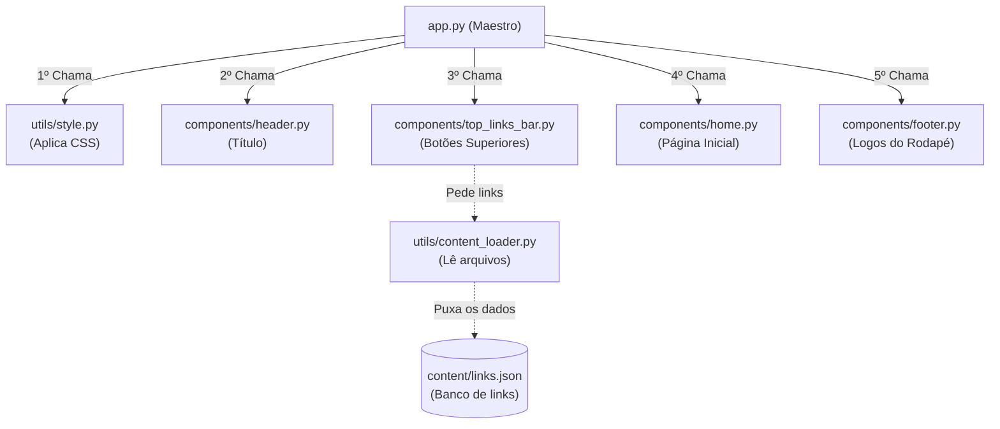

# 🏗️ Arquitetura e Fluxo do Código

Este documento explica como o código do **Repositório de Apoio à Telessaúde PB** está estruturado e, principalmente, **como os arquivos conversam entre si** para fazer o site funcionar.

---

## 1. O Ponto de Partida: `app.py`

Em projetos feitos com Streamlit, o arquivo principal (geralmente chamado de `app.py`) é o "cérebro" da aplicação. Quando um usuário acessa o site, o servidor lê e executa o `app.py` de cima para baixo.

O papel do `app.py` no nosso projeto não é ter todo o código visual e de texto, mas sim **orquestrar** as peças. Ele funciona como um maestro:
1. **Configura a página:** Define o título na aba do navegador e o layout largo (`st.set_page_config`).
2. **Importa os "Componentes":** Ele "chama" as funções visuais que estão guardadas na pasta `components/`.
3. **Controla as Rotas (Navegação):** Lê a URL do navegador (`st.query_params`) para saber qual página o usuário quer ver.
4. **Monta o "Quebra-cabeças":** Posiciona o cabeçalho, divide a tela em duas colunas (Menu e Conteúdo) e encaixa o rodapé no final.

---

## 2. A Divisão de Responsabilidades (Pastas)

Para que o `app.py` não fique com milhares de linhas e vire uma bagunça, o código foi dividido em pastas com responsabilidades únicas:

* 📁 **`components/` (O Visual):** Guarda os blocos visuais do site (Cabeçalho, Rodapé, Página Inicial, Sobre). O `app.py` pede para esses arquivos desenharem a tela.
* 📁 **`utils/` (As Ferramentas):** Guarda funções que trabalham nos bastidores (ex: injetar CSS para esconder a barra lateral padrão do Streamlit ou carregar dados de um arquivo).
* 📁 **`content/` (Os Dados):** Guarda arquivos como `.json` e `.md` (textos, links). O código vai ler esses arquivos em vez de ter texto "chumbado" no meio da programação.

---

## 3. O Fluxo de Conversa (Como os arquivos interagem)

Vamos analisar o que acontece nos bastidores no momento em que alguém abre o site:

### O Passo a Passo da Execução:

1. **Estilização (`utils/style.py`):** 
   Logo no começo, o `app.py` chama a função `apply_custom_css()`. Esse arquivo tem regras de CSS que "escondem" coisas feias do Streamlit padrão e dão o espaçamento correto da tela.
   
2. **Cabeçalho (`components/header.py`):**
   O `app.py` chama o cabeçalho, que renderiza aquele título grande azul no topo do site.

3. **Barra de Links e Carregamento de Dados:**
   O `app.py` pede para o `components/top_links_bar.py` desenhar os botões vermelhos. Mas esse componente precisa saber *quais* botões desenhar. Então ele "conversa" com o `utils/content_loader.py`, que por sua vez vai lá na pasta `content/links.json`, pega a lista de links (Telessaúde SES-PB, etc.), transforma em Python e devolve para a barra desenhar.

4. **Colunas Fixas e Roteamento:**
   O `app.py` divide a tela: `col_menu` (1/5 da tela) e `col_conteudo` (4/5 da tela). 
   Ele cria os links HTML de navegação na esquerda. Se o usuário clicou em "Sobre", a URL ganha um `?page=sobre`. O `app.py` lê isso e, por meio de um simples `if / elif`, decide acionar o `components/about.py` em vez do `components/home.py`.

5. **Rodapé (`components/footer.py`):**
   No final do `app.py`, independente da página carregada, ele chama o rodapé, que desenha as logos da SES, PET Saúde e UFPB.

## 4. Por que essa arquitetura é boa?

- **Manutenção Fácil:** Se você quiser mudar uma cor do rodapé, você não precisa abrir o `app.py` com o código inteiro do site. Você vai direto e somente no `components/footer.py`.
- **Escalabilidade (Crescimento):** Se amanhã você quiser adicionar uma aba "Artigos", basta criar um arquivo `components/artigos.py`, desenhar o visual dele lá dentro, e adicionar apenas um `elif page == "artigos":` no `app.py`.
- **Desacoplamento de Dados:** Como os links externos estão em um arquivo JSON (`content/links.json`), qualquer pessoa da equipe pode adicionar ou remover um botão apenas editando um texto em formato JSON, sem precisar saber programar em Python.
